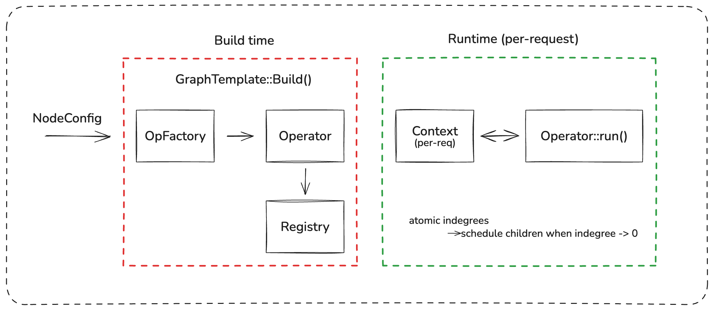
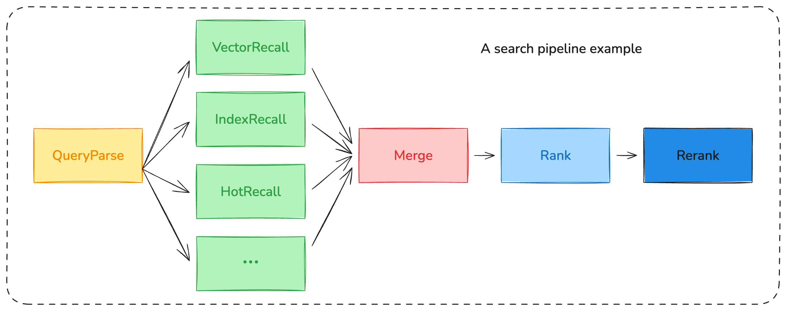

# minidag

[](https://github.com/D2hugging/minidag/actions/workflows/ci.yml)


[](https://opensource.org/licenses/MIT)
[](https://github.com/D2hugging/minidag)

Header-only C++17 DAG execution engine for concurrent pipelines.

## Highlights

- **Header-only** -- single file: `include/mini_dag.hpp`
- **Lock-free scheduling** with atomic indegree propagation
- **Type-safe data passing** between operators (`DataToken<T>` + `Context`)
- **Per-node timeout**, optional nodes, cancellation
- **Per-request metrics** (duration, skipped, timed\_out)
- **Data-driven graph topology** via JSON config
- **Multi-DAG management** with hot-reload (`DagManager`)

## Architecture Overview



Example search/recommend pipeline:



Recall nodes run concurrently on the thread pool. Merge waits for all recall nodes (optional nodes degrade gracefully). Rank produces the results by algorithm of choice. Rerank produces the final output.

## Quick Start

### Requirements

- CMake >= 3.20
- C++17 compiler (GCC 8+, Clang 7+, MSVC 19.14+)
- Dependencies fetched automatically via `FetchContent`:
  [nlohmann/json](https://github.com/nlohmann/json),
  [googletest](https://github.com/google/googletest)

### Build

```bash
cmake -B build -DCMAKE_BUILD_TYPE=Release
cmake --build build
```

### Run the example

```bash
./build/bin/exam_search example/example_conf.json
```

### Run tests

```bash
./build/bin/minidag_test
```

## Defining Operators

Subclass `Operator`, override `Init()` / `Run()` / `Name()`, and register with `REGISTER_OP`:

```cpp
#include "mini_dag.hpp"
using namespace minidag;

class MyOp : public Operator {
 public:
  void Init(Registry& reg) override {
    in_  = reg.Input<std::string>("input_key");
    out_ = reg.Output<int>("output_key");
  }

  void Run(Context& ctx) override {
    const auto& val = ctx.Get(in_);
    ctx.Set(out_, static_cast<int>(val.size()));
  }

  std::string Name() const override { return "MyOp"; }

 private:
  DataToken<std::string> in_;
  DataToken<int> out_;
};
REGISTER_OP(MyOp);
```

`Configure(const ConfigNode& conf)` is optional -- override it to read operator-specific params from JSON.

## JSON Configuration

Graph topology is fully data-driven. Each DAG defines its nodes, dependencies, and operator params:

```json
{
  "thread_pool_size": 4,
  "dags": {
    "search": {
      "nodes": [
        { "id": "parse_node", "op_type": "QueryParseOp", "dependencies": [] },
        {
          "id": "vec_node",
          "op_type": "VectorRecallOp",
          "dependencies": ["parse_node"],
          "optional": true,
          "timeout_ms": 200,
          "params": { "top_k": 20, "model_name": "advanced_vec_model" }
        },
        {
          "id": "merge_node",
          "op_type": "MergeOp",
          "dependencies": ["vec_node", "idx_node", "hot_node"]
        }
      ]
    }
  }
}
```

| Field | Type | Description |
|-------|------|-------------|
| `id` | string | Unique node identifier within the DAG |
| `op_type` | string | Registered operator name (must match `REGISTER_OP`) |
| `dependencies` | string[] | IDs of nodes that must complete before this node runs |
| `params` | object | Arbitrary key-value config passed to `Operator::Configure()` |
| `optional` | bool | If `true`, failures are logged and skipped instead of aborting |
| `timeout_ms` | int | Post-hoc timeout check; exceeding it marks the node timed out |

See `example/example_conf.json` for a complete two-pipeline config.

## Using the Library (C++ API)

```cpp
#include "mini_dag.hpp"
using namespace minidag;

// 1. Create a DagManager with a thread pool
DagManager manager(/*threads=*/4, StderrLogger(LogLevel::kInfo));

// 2. Build a DAG from config
manager.BuildDag("search", node_configs);

// 3. Create a per-request executor
auto executor = manager.CreateExecutor("search");

// 4. Inject input via typed token
auto req_token = executor->Template().Token<UserRequest>("request");
executor->Ctx().Set(req_token, UserRequest{1001, "iPhone 16"});

// 5. Run and wait
auto future = executor->Run();
future.get();  // blocks until complete (or throws on failure)

// 6. Read output via typed token
auto result_token = executor->Template().Token<RankResult>("final_result");
const auto& result = executor->Ctx().Get(result_token);
```

### Cancellation and Timeouts

```cpp
auto future = executor->Run();
if (future.wait_for(std::chrono::milliseconds(500)) ==
    std::future_status::timeout) {
  executor->Cancel();  // cooperative cancellation via atomic flag
}
```

### Per-Request Metrics

```cpp
for (const auto& m : executor->Metrics()) {
  std::cout << m.name << ": " << m.duration_us << "us";
  if (m.skipped)   std::cout << " [SKIPPED]";
  if (m.timed_out) std::cout << " [TIMED_OUT]";
  std::cout << "\n";
}
```

### Hot-Reload

```cpp
manager.ReplaceDag("search", new_node_configs);  // atomic swap
```

## Project Structure

```
minidag/
  include/
    mini_dag.hpp            # Core library (header-only)
  example/
    data_types.hpp          # Domain data structures (UserRequest, Item, etc.)
    operators.hpp           # Example operators (QueryParse, Recall, Merge, Rank)
    loader.hpp              # JSON-to-ConfigNode bridge using nlohmann/json
    exam_search.cc          # Example binary: runs search + recommend DAGs
    example_conf.json       # Two-pipeline JSON config
  tests/
    minidag_test.cc         # Unit tests (Google Test)
  CMakeLists.txt
```

## Build Options

| CMake Option | Default | Description |
|-------------|---------|-------------|
| `MINIDAG_BUILD_TESTS` | `ON` | Build unit tests (`minidag_test`) |
| `CMAKE_BUILD_TYPE` | -- | `Debug` (with sanitizers) or `Release` (with `-O2`) |

To disable tests:

```bash
cmake -B build -DMINIDAG_BUILD_TESTS=OFF
```

## License

MIT -- see [LICENSE](LICENSE).
